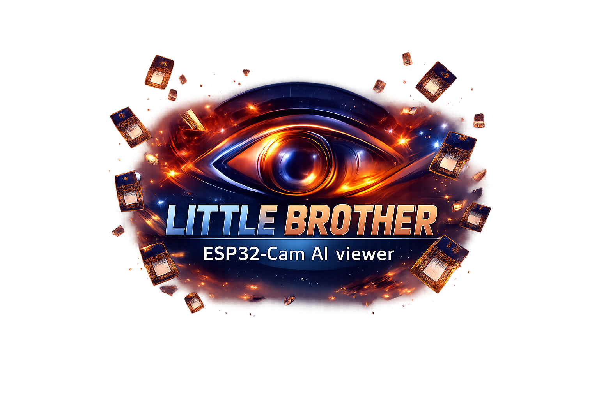

ESP32_CAM_AI

ESP32_CAM_AI is an ESP32-CAM (OV2640) firmware with a web UI (port 80), MJPEG stream server (port 81), PTZ controls, Wi-Fi/auth management, OTA updates, and a companion desktop viewer (PySide6/Qt) for multi-camera monitoring, recording, and optional CV overlays.

Highlights
- Web UI: resolution selector, PTZ step buttons, flash toggle/level slider, Wi-Fi/auth setup with stream token for cross-port embed.
- Streaming: MJPEG on :81/stream plus :81/snap for single frames; designed for broad viewer compatibility.
- Flash control: GPIO4 driven with 20 kHz PWM, state persisted; forced low during OTA start/failure to prevent stuck-on flash.
- OTA ready: ArduinoOTA setup in firmware; camera deinit before OTA to free memory.
- Desktop viewer: multi-camera MDI, pre-buffered recording, optional YOLO/face/pet recognition, network scan via /api/advertise.

Firmware Quickstart
1) Install PlatformIO (VS Code extension or CLI).
2) Use env `esp32cam_serial` in `platformio.ini`.
3) Wire ESP32-CAM (AI Thinker pinout); optional PTZ servos on GPIO14/15; flash LED is GPIO4.
4) Flash over serial: `pio run -e esp32cam_serial -t upload` (monitor 115200 if needed).
5) Boot behavior: tries stored Wi-Fi; if none, launches config portal AP so you can set Wi-Fi/auth.
6) Open `http://<device-ip>/` for the UI. Stream at `http://<device-ip>:81/stream`; snapshot at `http://<device-ip>:81/snap`.

OTA Upload (optional)
- Ensure the device is on Wi-Fi and reachable (IP shown in UI/serial).
- In `[env:esp32cam_OTA]`, set `upload_port = <device-ip>` or pass `--upload-port <ip>` on the CLI.
- Upload with `pio run -e esp32cam_OTA -t upload` (espota). Camera is deinit and flash forced low during OTA; if OTA fails, flash stays off.

Key Endpoints
- `/` or `/cam`: web UI.
- `/wifi`: Wi-Fi/auth/token setup.
- `/api/status`: JSON with IP, framesize, flash state, PTZ.
- `/api/flash?on=0|1` or `/api/flash?level=0-1023`: flash control with persistence.
- `/ptz/step?dx=<int>&dy=<int>`: PTZ nudge.
- `:81/stream` and `:81/snap`: MJPEG stream and snapshot.

Desktop Viewer
- Python 3.12 recommended. Install deps: `py -3.12 -m pip install numpy opencv-python requests pygame PySide6`.
- Launch: `python AI/mdi_app.py`.
- Features: multi-camera windows, pre-buffered recording (AVI/MJPG on Windows), optional YOLO/face/pet overlays, duplicate-by-IP prevention, Tools -> Scan For Cameras using `/api/advertise`.

Repo Structure
- `src/`: firmware (CameraServer, StreamServer, WiFiManager, OTAHandler, PTZ, Utils).
- `AI/`: desktop viewer app and assets.

License
- CC BY-NC 4.0: https://creativecommons.org/licenses/by-nc/4.0/
- Non-commercial use only; attribute with a link back to this repository.
